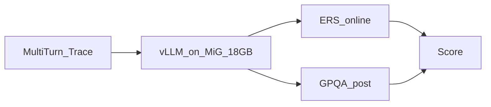
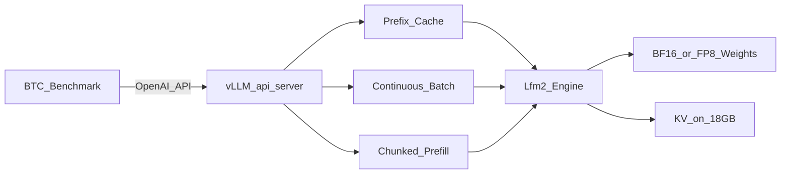
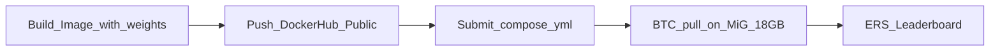

# CONTEXT — Technical Strategy Report (Updated)
## Viettel AI Race 2026 · Challenge 3  
**Team Develarper · Model: LiquidAI/LFM2.5-1.2B-Instruct · Slice: MiG H200 18GB**

> Cập nhật theo đề mới: model cố định 1.2B, **chỉ vLLM**, MiG **18GB**, ERS params đã công bố, nộp Docker Hub + compose.  
> Đề chi tiết: [PROBLEM_VN.md](PROBLEM_VN.md) · Việc làm ngày-ngày: [PLAN.md](PLAN.md)

---

## 1. Executive Brief (hiểu trong 60 giây)

Cuộc thi **không** phải train model. BTC bắt phục vụ đúng model **LFM2.5-1.2B-Instruct** bằng **vLLM**, trên **1 MiG H200 chỉ 18GB VRAM**.

Online chỉ chấm **nhanh/ổn** (ERS). Sau vòng mới kiểm **còn đúng không** (GPQA, baseline ~0.4).

```text
Score = 100 × ERS × f(Δ)
```

| Trục | Ý nghĩa đời thường | Số quan trọng |
|---|---|---|
| **TTFT** | Thời gian chờ chữ đầu | Floor 10ms · Ceiling 400ms · γ=2 · w=0.5 |
| **TPOT** | Thời gian giữa các chữ | Floor 1ms · Ceiling **10ms** · γ=2 |
| **Δ** | Độ sụt GPQA vs BF16 | ≤0.10 giữ điểm; ≥0.16 → Score=0 |
| **VRAM** | “Bếp” chỉ 18GB | Model nhỏ ~vài GB → phần lớn VRAM cho **KV / concurrency** |

**Định hướng 1 câu:** *Bake weights vào image vLLM (baseline ≥ v0.22.1, kiểm tra support LFM2), bật prefix caching mạnh vì shared system prefix, tối ưu decode/TPOT dưới 10ms ceiling, giữ accuracy; quant online/FP8 là đòn bẩy phụ trên model 1.2B.*

---

## 2. Đề mới đổi gì so với giả định cũ?

| Trước (đoán) | Nay (đề thật) | Hệ quả cho đội |
|---|---|---|
| Model lớn chưa biết, cần AMD MI300X nén | **LFM2.5-1.2B** (~edge-size) | Quant có thể làm **local / GPU nhỏ**; AMD không còn P0 |
| Full H200 141GB | **MiG 18GB** | Không “vung VRAM”; tối ưu **batch đồng thời + prefix** |
| Engine tự chọn | **Chỉ vLLM** | Bỏ SGLang/TRT-LLM |
| ERS params ẩn | **F/C/γ/w công bố** | Có thể tune theo hàm điểm thật |
| Compose tự do | Entrypoint **bắt buộc form** `python3 -m vllm.entrypoints.openai.api_server` | Sửa scaffold compose cho khớp mẫu BTC |
| Offline quant là trụ | Đề nhấn **Online Quantization** | Ưu tiên flag quant runtime trước; offline vẫn OK nếu ổn định hơn |

---

## 3. Mental model chấm điểm (với số thật)



### 3.1 Vì sao TPOT 10ms ceiling là “khó”

γ=2 → điểm rơi **nhanh** khi ra khỏi vùng tốt. TPOT ceiling chỉ **10ms/token** → decode phải rất nhanh và ổn định dưới tải đồng thời (`num_conversations` lớn). Một spike HoL (prefill dài chặn decode) phá hàng loạt `s_tpot`.

### 3.2 Vì sao prefix caching là P0 tuyệt đối

Trace có **`shared_system_prefix_tokens`** giống mọi hội thoại + multi-turn history. Mỗi lần recompute prefix = phí TTFT vô ích. `--enable-prefix-caching` trong mẫu BTC là điểm xuất phát đúng — đội phải **giữ và khai thác triệt để**, không tắt trừ khi A/B chứng minh hại.

### 3.3 Reliability

Lỗi / timeout / 0 token → **S = 0**. Trên 18GB, OOM khi tăng concurrency vẫn là rủi ro nếu `max-model-len` / mem-util / KV quá tham.

---

## 4. Model & Stack mục tiêu

### 4.1 Model

- **ID:** `LiquidAI/LFM2.5-1.2B-Instruct`
- **Kiến trúc:** LFM2 hybrid (gated short-convolution xen GQA) — KV nhỏ hơn full-attention cùng size, decode thiên về nhanh/edge
- **Context:** tới 32K (đề mẫu `--max-model-len=32768`)
- **vLLM:** native `Lfm2ForCausalLM` (công thức serve theo docs Liquid/vLLM recipes)

**Version đã chốt trong repo:** Dockerfile mặc định `vllm/vllm-openai:latest-cu130` vì docs Liquid/vLLM pin LFM2.5 ở **≥ 0.23.0**. Mẫu BTC `v0.22.1` có nguy cơ **không load** `Lfm2ForCausalLM` — chỉ dùng nếu verify được. Entrypoint vẫn đúng form BTC (`python3 -m vllm.entrypoints.openai.api_server`).

### 4.2 Kiến trúc serving



| Layer | P0 (nộp sớm) | P1 (sau khi có ERS) |
|---|---|---|
| Image | Bake `/model` weights, **no network** lúc chạy | Pin digest |
| Prefix cache | **ON** | Giữ |
| gpu-memory-utilization | 0.90–0.95 (baseline mẫu 0.95) | Sweep 0.88–0.95 nếu OOM/ERS |
| max-model-len | Bắt đầu theo workload thật; 32K nếu trace cần | Giảm nếu lãng phí KV |
| Chunked prefill | ON nếu version hỗ trợ ổn | A/B TTFT↔TPOT |
| Online / FP8 quant | Thử sau P0 BF16 ổn | Giữ nếu TPOT↑ và Δ OK |
| KV-FP8 | Không mặc định | A/B concurrency |
| Speculative | Thấp ưu tiên (model đã nhỏ) | Chỉ nếu có draft hợp lệ + ERS↑ |

---

## 5. Chiến lược tối ưu theo đòn bẩy (ưu tiên)

### P0 — “Chạy đúng + prefix”

1. Image public Docker Hub, weights **trong image** tại `/model`
2. Compose đúng form entrypoint BTC
3. `--enable-prefix-caching`
4. `--served-model-name=LFM2.5-1.2B-Instruct`
5. Health + streaming ổn; nộp lấy ERS baseline

**Đạt được:** điểm >0, biết floor thực tế trên MiG.

### P1 — “Ép TPOT / concurrency trên 18GB”

1. Sweep `max-num-batched-tokens`, `gpu-memory-utilization`
2. Chunked prefill on/off
3. Online FP8 / quant flag vLLM (đề cho phép)
4. KV dtype FP8 nếu tăng batch mà không phá Δ / TTFT

**Đạt được:** nhiều conversation đồng thời hơn, TPOT gần floor hơn dưới tải.

### P2 — “Hệ thống”

CUDA Graphs / FlashInfer / Triton — chỉ khi còn ngày và P1 đã bão hòa.

### Cố ý không làm

- Đổi engine (cấm)
- Dual-path / gọi HF lúc serve (cấm mạng ngoài)
- Tin latency AMD/local consumer = H200 MiG
- Quant “nặng” làm Δ ≥ 0.10 không cần thiết (baseline 0.4; margin còn nhưng đừng tham)

---

## 6. Resource đội (cập nhật)

| Nguồn | Vai trò mới |
|---|---|
| **Local 16–32GB** | Download 1.2B, build image, smoke API, ERS sim với **params thật** |
| **Firework ~100** | Smoke GPQA thô / so Δ — ít lần |
| **AMD ~50** | **Không còn bắt buộc** cho quant 1.2B; giữ buffer hoặc 1 session nếu local không có GPU NVIDIA |
| **BTC MiG** | Lab ERS duy nhất đáng tin (mỗi lần submit) |

---

## 7. Nộp bài đúng luật



- Image **public**
- Compose trỏ đúng tag/digest
- Entrypoint: `python3 -m vllm.entrypoints.openai.api_server` (không đổi sang `vllm serve` nếu BTC yêu cầu form mẫu)
- Không download weight lúc start

---

## 8. Team RACI (giữ 2 AI + 1 DevOps)

| Role | Focus mới |
|---|---|
| **AI1** | Model card LFM2.5; quant online/FP8; GPQA smoke; chat template |
| **AI2** | Flags vLLM; ERS sim với F/C/γ/w thật; ablation sheet theo submit |
| **DevOps** | Dockerfile bake `/model`; Hub push; compose mẫu BTC; anti-cheat; portal |

---

## 9. Rủi ro chính

| Risk | Impact | Mitigation |
|---|---|---|
| `v0.22.1` chưa chạy LFM2.5 | Không boot | Thử tag vLLM mới hơn; pin digest đã prove |
| TPOT > 10ms dưới tải | ERS thấp (γ=2) | Prefix + chunked + giảm contention; quant/decode opts |
| OOM 18GB | S = 0 | Hạ mem-util / max-model-len; đo peak concurrent |
| Quant quá tay | f(Δ) < 1 hoặc 0 | P0 BF16; quant chỉ khi ERS↑ rõ |
| Compose sai entrypoint | BTC không chấm | Copy form mẫu, chỉ sửa `command` flags + `image` |

---

## 10. Kết luận

Đề mới biến cuộc chơi từ “nén model khổng lồ” thành **serving edge-LLM trên VRAM hẹp, latency cực gắt, khai thác shared prefix**.  

Thắng = **image đúng luật + prefix cache + TPOT ổn định dưới tải + không lỗi**, rồi mới quant/KV tinh chỉnh. Chi tiết lịch và checklist: **[PLAN.md](PLAN.md)**.
