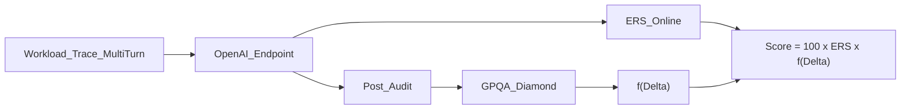
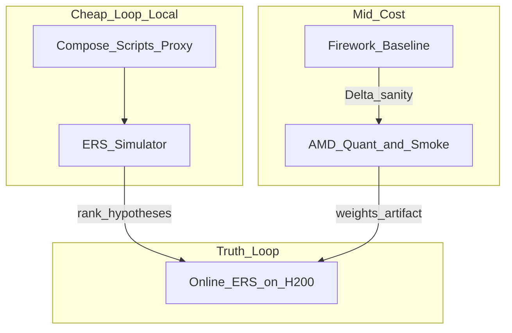
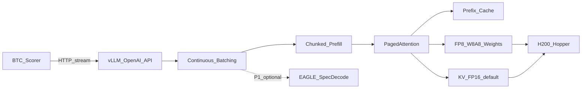
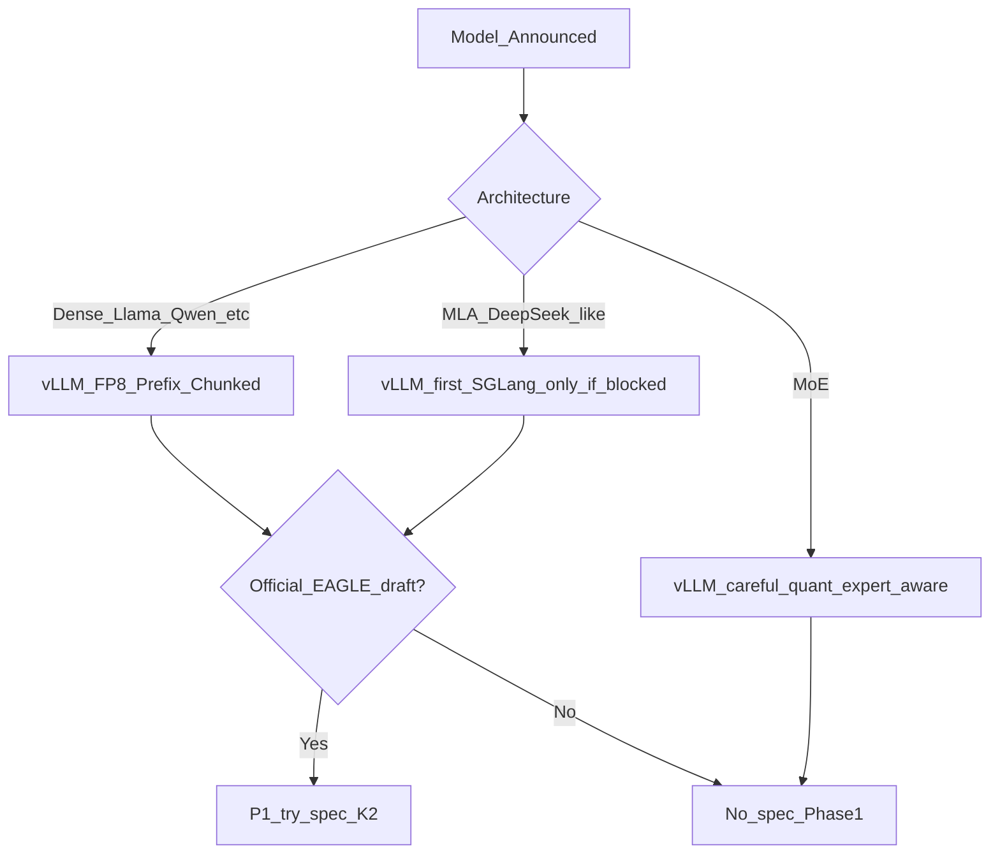
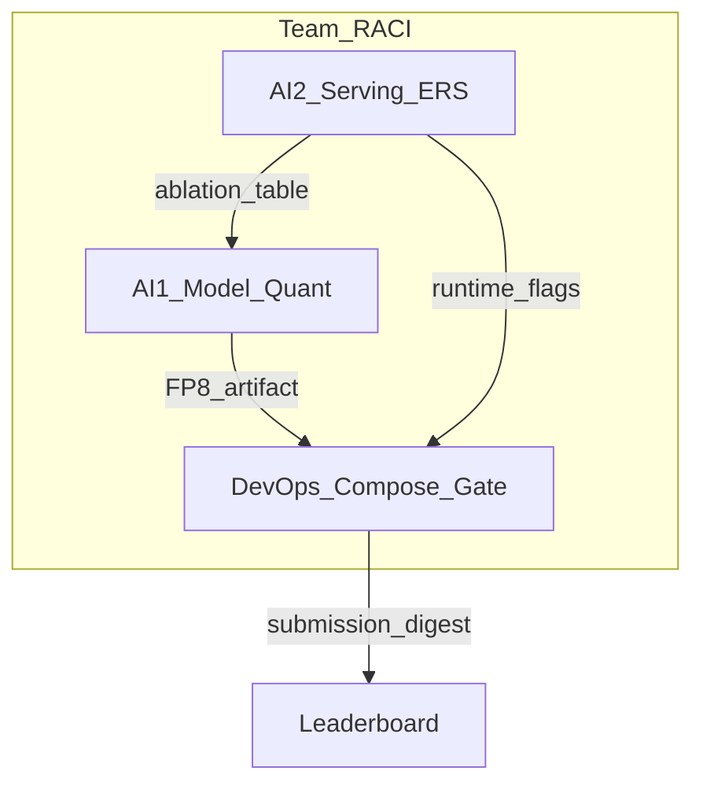

# CONTEXT — Technical Strategy Report  
## Viettel AI Race 2026 · Challenge 3: LLM Inference Optimization  
**Team:** Develarper · **Phase 1 target:** 30/07/2026 · **Hardware chấm:** NVIDIA H200

> Tài liệu này là **báo cáo kỹ thuật + chỉ đạo chiến lược**: tụi mình tính làm gì, dùng gì, vì sao, đạt được gì — trong điều kiện tài nguyên thật (local 16–32GB RAM × 3 máy, ~100 credit Firework AI, ~50 credit AMD Cloud). BTC **chưa công bố model** và **chưa cấp cluster dev**; hiện chỉ có đề bài + repo này.

---

## 1. Executive Brief

| | |
|---|---|
| **Mục tiêu Phase 1** | Nộp Docker Compose serving OpenAI-compatible trên H200; maximize **ERS**; giữ **Δ ≤ 0.10** để \(f(\Delta)=1\). |
| **Chiến lược 1 câu** | *Stable vLLM + FP8 W8A8 + Prefix Cache + Chunked Prefill; tune latency bằng ERS simulator local + điểm online BTC; AMD chỉ để nén model & smoke functional; Firework chỉ để baseline chất lượng.* |
| **Không làm Phase 1** | TensorRT-LLM từ đầu, custom CUDA lớn, disagg P/D, semantic cache rủi ro anti-cheat, đo TTFT/TPOT trên AMD để chọn winner. |
| **Definition of Done** | Compose chạy offline; `/v1/chat/completions` streaming ổn; error/timeout ≈ 0 trên trace giả lập; có ít nhất 1 submission P0 trên leaderboard; checklist anti-cheat pass. |

**Vì sao hướng này thắng được với resource nghèo:** đề cho tự do tối ưu, nhưng vòng online chỉ chấm ERS; accuracy hậu kiểm. Đội nhỏ không có H200 để sweep — phải biến **online submission** thành lab latency, còn local/AMD/Firework làm đúng việc rẻ của chúng.

---

## 2. Bài toán → Mental Model Chấm điểm

### 2.1 Hai trục



- **ERS** (online mỗi lần nộp): trung bình \(S_{\text{request}}\) trên \(N\) request. Lỗi / timeout / 0 token → **\(S=0\)**.
- **Accuracy Gate** (sau vòng online, chọn ≤5 submission): \(\Delta = Acc_{BF16} - Acc_{sub}\); \(\Delta \le 0.10\) giữ hệ số 1.0; \(\Delta \ge 0.16\) → điểm 0.

### 2.2 Hệ quả thiết kế (quan trọng hơn “chạy nhanh”)

1. **Reliability là P0 tuyệt đối** — một spike OOM làm chết cả cụm request liên tiếp trên multi-turn.
2. **TTFT vs TPOT phải cân** theo \(w, F, C, \gamma\) (BTC sẽ công bố / có trong trace update). Chưa có số → giữ config trung dung + sweep khi có.
3. **Không dual-path** — cùng một behavior cho đo latency và GPQA.
4. **Multi-turn + think time** → prefix trùng lịch sử hội thoại là đòn bẩy “miễn phí” hợp lệ.

### 2.3 Công thức nhắc nhanh

\[
S_{\text{request}} = w\cdot s_{\text{ttft}} + (1-w)\cdot s_{\text{tpot}}
\]

\[
s = \left[\mathrm{clamp}\left(\frac{C - L}{C - F}, 0, 1\right)\right]^{\gamma}
\]

**Đạt được gì khi hiểu đúng:** mọi flag vLLM phải trả lời được câu *“cải thiện \(s_{\text{ttft}}\), \(s_{\text{tpot}}\), hay giảm error rate?”* — không tối ưu tokens/s thuần.

---

## 3. Ràng buộc Tài nguyên Thật & Nguyên tắc Vận hành

### 3.1 Inventory

| Nguồn | Có gì | Dùng để | Không dùng để |
|---|---|---|---|
| **Local ×3** (16–32GB RAM) | CPU/RAM, có thể GPU consumer nhỏ | Code, Compose, proxy 7B/8B, ERS simulator, unit/smoke API | Load full BF16 model lớn, đo ERS “thật” |
| **Firework ~100 credit** | API inference | Baseline / proxy accuracy thô, vài smoke chất lượng | Ablation lặp, decode latency lab |
| **AMD Cloud ~50 credit** | GPU lớn (đề xuất MI300X) | **1–2 lần** quant FP8 + pack weights; serve functional; 1 smoke lm_eval | Sweep TTFT/TPOT (số liệu không transfer sang H200) |
| **BTC H200** (lúc chấm/nộp) | GPU đích | **Lab latency duy nhất đáng tin** qua điểm ERS online | — |
| **BTC assets** | Chưa có model / cluster / (có thể) trace | Portal theo dõi hàng ngày — **unblock #1** | Không ngồi chờ mãi mà không scaffold |

### 3.2 Gợi ý thuê AMD (hợp lý với ~50 credit)

| Lựa chọn | Khi nào | Lý do |
|---|---|---|
| **Ưu tiên: MI300X (192GB)** | Quant + load model ≥30B / cần headroom KV | Đủ VRAM để `llm-compressor` oneshot + serve functional không shard phức tạp; khớp “artifact factory” |
| **MI250 / card nhỏ hơn** | Chỉ prototype proxy / hết credit MI300X | Rẻ hơn nhưng dễ OOM khi quant model lớn |
| **Không ưu tiên multi-node** | Phase 1 | Tốn credit + phức tạp compose; đề là tối ưu serving trên slice H200 |

**Cách đốt credit:** tối đa **2 session dài có checklist** (Session A: quant+export; Session B: vLLM load FP8 + smoke). Mọi thử flag latency để dành cho submission BTC.

### 3.3 Quy tắc vàng resource-poor



---

## 4. Kiến trúc Hệ thống Mục tiêu (H200)

### 4.1 Serving stack



| Thành phần | Quyết định Phase 1 | Lý do kỹ thuật | Đạt được |
|---|---|---|---|
| **Engine** | **vLLM** | Out-of-box continuous batching, PagedAttention, prefix cache, FP8; cộng đồng lớn; thời gian đội nhỏ | Time-to-working-system ngắn, ít rủi ro biên dịch |
| **Quant** | **FP8 W8A8 offline** (`llm-compressor`), giữ `lm_head` BF16 | Hopper native FP8; decode memory-bandwidth bound; Δ thường nhỏ hơn INT4 | Giảm weight traffic → TPOT tốt hơn; fit KV nhiều hơn |
| **Prefix cache** | **ON** | Trace multi-turn tái sử dụng history | Giảm prefill → TTFT tốt hơn turn 2+ |
| **Chunked prefill** | **ON** | Tránh HoL blocking khi prefill dài đóng băng decode | Làm mượt TPOT dưới tải lẫn |
| **KV dtype** | **FP16 mặc định; FP8 = A/B** | FP8 KV tăng batch nhưng có rủi ro accuracy / kernel | Chỉ giữ nếu ERS↑ và smoke Δ ổn |
| **Speculative** | **OFF mặc định** | Chưa có model → chưa chắc có draft EAGLE; dễ phá TTFT | Bật P1 chỉ khi BTC cho draft/path rõ |
| **TensorRT-LLM / custom CUDA** | **Không Phase 1** | Learning curve + compile risk > lợi ích trong ~10 ngày | Giữ slot thời gian cho reliability |

### 4.2 Config ứng viên (không phải “winner cứng”)

**P0 — Safe Champion (nộp trước):**

```bash
vllm serve /model_weights/LLM-FP8 \
  --host 0.0.0.0 --port 8000 \
  --gpu-memory-utilization 0.90 \
  --max-model-len <FROM_MODEL_OR_TRACE> \
  --enable-prefix-caching \
  --enable-chunked-prefill \
  --max-num-batched-tokens 4096
```

**P1 — Aggressive (chỉ sau khi P0 có điểm ERS):**

- Thêm `--kv-cache-dtype fp8`
- Sweep `--max-num-batched-tokens` ∈ {2048, 4096, 8192}
- Sweep `--gpu-memory-utilization` ∈ {0.88, 0.90, 0.92}
- Speculative `num_speculative_tokens=2` **nếu** có draft chính thức

**Vì sao không hardcode 2048 / 0.93 / EAGLE K=3 như bản research cũ:** các số đó phụ thuộc \(w,F,C\) và concurrency trace; áp dụng mù có thể hại TTFT hoặc OOM → \(S=0\).

---

## 5. Quyết định theo Model (khi BTC công bố)

BTC chưa công bố model. Mọi đường dưới đây là **decision tree** — AI1 kích hoạt trong 24h sau khi có tên model.



| Tín hiệu model | Việc phải làm ngay | Rủi ro |
|---|---|---|
| Dense 70B-class | FP8 offline trên MI300X; `max-model-len` theo context đề | Image size / thời gian pack |
| MoE | Không quant mù mọi expert; đọc doc vLLM MoE FP8 | OOM / sai expert routing |
| MLA | Ưu tiên vLLM hỗ trợ sẵn; chỉ cân SGLang nếu thiếu kernel | Mất thời gian đổi engine |
| Có chat template đặc thù | Khóa template trong serve; test streaming | Sai template → GPQA sập dù FP8 “đẹp” |

**Đạt được gì:** không lock chết một stack sai architecture; vẫn ship P0 trong Phase 1.

---

## 6. Lượng tử hóa & Chất lượng

### 6.1 Vì sao FP8 W8A8 (không phải AWQ-4 trước)

- Decode LLM trên H200 **memory-bandwidth bound** → giảm bitwidth weight tăng hiệu dụng băng thông.
- Hopper có Tensor Core FP8 → ít overhead dequant hơn INT4 kiểu cũ.
- Accuracy Gate cho \(\Delta \le 0.10\) trước khi phạt — FP8 thường nằm trong vùng an toàn **nếu** giữ `lm_head` và đúng chat template; INT4 dễ gần biên nguy hiểm hơn trên GPQA Diamond.
- Offline compress → cold start submission nhanh, không quant động lúc boot (tránh timeout / hành vi bất định).

### 6.2 Pipeline quant (chạy trên AMD MI300X)

1. Tải BF16/BF16-equivalent baseline **đúng revision BTC**.
2. `llm-compressor` recipe FP8, `ignore=["lm_head"]`.
3. Export `compressed-tensors` mà vLLM load được.
4. Smoke: 20–50 prompt + (nếu credit đủ) slice GPQA — so với số Firework/BTC baseline.
5. Pack vào image; **cấm** download weight lúc container start.

### 6.3 Accuracy workflow tiết kiệm credit

| Bước | Tool | Credit |
|---|---|---|
| Baseline tham chiếu | Firework hoặc số BTC công bố | 20–40 Firework |
| Sau quant smoke | AMD lm_eval ngắn / subset | 1 session AMD |
| Final GPQA tin cậy | BTC hậu kiểm | 0 (nhưng chọn đúng 5 ảnh) |

**Không tin** điểm Firework tuyệt đối trùng BTC — chỉ dùng hướng \(\Delta\) thô. Khi BTC publish \(Acc_{baseline}\), khóa theo số đó.

---

## 7. Scheduling, KV, Prefill — Liên hệ trực tiếp ERS

| Kỹ thuật | Cơ chế | Ảnh hưởng ERS | Cách dùng đội mình |
|---|---|---|---|
| Continuous batching | Iteration-level | Throughput + giảm chờ | Mặc định vLLM |
| PagedAttention | Block KV | Tăng batch, giảm OOM | Mặc định |
| Prefix caching | Hash block tái sử dụng | TTFT turn sau ↓ | **P0 ON** |
| Chunked prefill | Xen kẽ prefill/decode | TPOT ổn hơn khi lẫn tải | **P0 ON** |
| `max-num-batched-tokens` | Ngân sách token/step | Trade TTFT↔TPOT | **Sweep online** |
| KV FP8 | Nén KV | Batch↑, rủi ro Δ | **P1 A/B** |

**Giả lập local (không GPU lớn):** khi có public redacted trace (arrival + token in/out), viết simulator:

- Replay concurrency / queueing giả định throughput model.
- Tính \(S_{\text{request}}\) với \(F,C,w,\gamma\) khi có.
- **Xếp hạng giả thuyết config** trước khi đốt 1 lượt nộp BTC.

Mục tiêu simulator: không dự đoán số ERS tuyệt đối trên H200, mà **loại config chắc chắn tệ** (ví dụ batched-tokens quá thấp khi \(w\) cao).

---

## 8. Speculative Decoding — Vị trí thật trong kế hoạch

- Lý thuyết: draft-then-verify lossless về phân phối → thân thiện Accuracy Gate.
- Thực tế Phase 1: **phụ thuộc draft model**; overhead có thể làm xấu TTFT dưới tải.
- Quyết định: **không phải trụ cột**. Chỉ thử P1 với \(K=2\) sau Safe P0, có số ERS trước/sau.

---

## 9. Anti-Cheat & Production Hygiene

| Cấm (đề) | Cách đội mình tuân thủ |
|---|---|
| Pre-bake / hardcode | Không nhúng đáp án; inference realtime |
| Dual-path | Một entrypoint / một sampling policy |
| Gaming metrics | Không dummy pad / cắt output trái phép |
| Gọi mạng ngoài | Image offline; không Firework lúc serve |
| Tráo image | Pin digest; log submission |

**Đạt được gì:** tránh void bài khi đã có ERS cao — rủi ro “top rồi bị hủy” lớn hơn rủi ro thiếu 2% throughput.

---

## 10. Tổ chức 3 người (2 AI + 1 DevOps)



| Vai trò | Trách nhiệm cốt lõi | Deliverable | Tool |
|---|---|---|---|
| **AI1 — Core Model & Quant** | Theo dõi công bố model; recipe FP8; kiểm Δ thô; chat template | Thư mục weights FP8 + báo cáo Δ smoke | `llm-compressor`, Firework, AMD |
| **AI2 — Serving & Scheduling** | Flags vLLM; ERS sim; bảng ablation; đọc online score | `serve.sh` P0/P1 + ablation sheet | vLLM config, Python sim |
| **DevOps — System & Eval** | Docker Compose H200; offline; healthcheck; lm_eval script; anti-cheat audit; lịch submit | `docker-compose.yml`, CI smoke, submission log | Docker, bash, `lm-eval` |

**Sync:** 15 phút/ngày — unblock model/trace, credit còn lại, điểm ERS mới, quyết định nộp/giữ.

---

## 11. Thứ tự Ưu tiên Kỹ thuật (P0 → P3)

| Priority | Việc | Owner | Thành công khi |
|---|---|---|---|
| **P0** | Portal: lấy model/trace/params ngay khi có | Cả team | Unblock quant + sim |
| **P0** | Compose + OpenAI streaming contract | DevOps + AI2 | Smoke local proxy pass |
| **P0** | FP8 artifact + P0 serve flags | AI1 + AI2 | Load được trên AMD; nộp BTC |
| **P0** | Error rate ≈ 0 (OOM/timeout) | AI2 + DevOps | Không thấy \(S=0\) hàng loạt |
| **P1** | Sweep batched-tokens / mem-util trên online ERS | AI2 | ERS↑ so với P0 |
| **P1** | KV-FP8 A/B | AI1 + AI2 | ERS↑ và smoke Δ ổn |
| **P2** | Speculative nếu có draft | AI2 | ERS↑, TTFT không sập |
| **P3** | FlashInfer / CUDA graphs tinh chỉnh | AI2 | Chỉ nếu còn ngày |

---

## 12. Rủi ro & Mitigation

| Rủi ro | Impact | Mitigation |
|---|---|---|
| Model công bố muộn | Không kịp quant đẹp | Scaffold proxy + compose trước; reserving AMD session sẵn script |
| Hết AMD credit giữa chừng | Không pack được FP8 | 2 session cứng; rehearse script local CPU path trước |
| Tin latency AMD | Chọn sai config | Cấm dùng AMD TTFT làm quyết định |
| OOM trên H200 | ERS sập | `gpu-memory-utilization` conservative; giảm max-model-len nếu đề cho phép |
| FP8 + KV-FP8 cộng dồn Δ | \(f(\Delta)<1\) hoặc 0 | P0 không KV-FP8; đo smoke trước khi giữ |
| Sai chat template / BOS | GPQA fail | Lock template; `add_bos_token` khi eval |

---

## 13. Metrics Nội bộ (team dashboard)

| Metric | Nguồn | Target Phase 1 |
|---|---|---|
| Submit success / health | DevOps log | Container up, `/v1/models` OK |
| Online ERS | Leaderboard | Tăng dần theo ablation |
| Error rate (ước lượng) | Log + sim | → 0 |
| Δ smoke | Firework/AMD | Giữ cảm giác \(\ll 0.10\) |
| Credit còn | Sheet | ≥ buffer 20% đến D-2 |

---

## 14. Những gì Cố ý Loại khỏi CONTEXT cũ

Bản research trước đúng hướng nhưng **không khớp resource** và **overclaim**. Bản này chỉnh:

| Cũ | Mới |
|---|---|
| AMD = staging cận production latency | AMD = artifact factory |
| KV-FP8 “bắt buộc” | A/B P1 |
| EAGLE 2–6× là trụ cột | Optional P1, \(K=2\) |
| `batched-tokens=2048`, `mem=0.93` cứng | Sweep |
| Firework = ground truth GPQA | Baseline thô; ưu tiên số BTC |
| Essay dài chung chung | Decision + owner + credit + DoD |

---

## 15. Kết luận Chiến lược

Với điều kiện hiện tại (**chưa có model**, chỉ có đề + repo, resource hẹp), đường thắng thực tế là:

1. **Scaffold ngay** (Compose, API contract, simulator, script quant) trước khi BTC mở model.  
2. **Một artifact FP8 sạch + P0 flags ổn định** lên H200 sớm để có điểm.  
3. **Ablation có kiểm soát** bằng online ERS, không đốt cloud.  
4. **Giữ Δ an toàn** — Score = ERS × \(f(\Delta)\); mất accuracy gate = mất hết.  

Chi tiết lịch ngày, checklist, và lệnh cụ thể nằm ở **[PLAN.md](PLAN.md)**.
