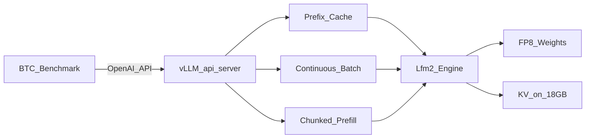
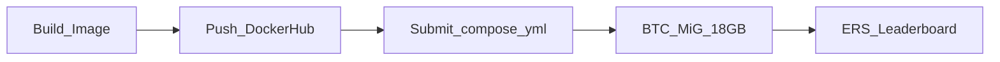

# Technical Strategy — Team Develarper

**Viettel AI Race 2026 · Challenge 3**  
**Model:** `LiquidAI/LFM2.5-1.2B-Instruct` · **Slice:** MiG H200 18GB  
**Last updated:** 2026-07-26

> Single source of truth cho chiến lược kỹ thuật, thử nghiệm, bottleneck và hướng tối ưu.  
> Đề bài & luật chơi: [COMPETITION.md](COMPETITION.md) · Submit hiện tại: [../submit/BTC_SUBMISSION.md](../submit/BTC_SUBMISSION.md)

---

## 1. Executive brief (60 giây)

Cuộc thi **không** train model. BTC bắt serve **LFM2.5-1.2B-Instruct** bằng **vLLM** trên **1 MiG H200 18GB VRAM, 3 vCPU**.

Online chỉ chấm **nhanh/ổn** (ERS). Sau vòng mới kiểm **còn đúng không** (GPQA, baseline ~0.4).

```text
Score = 100 × ERS × f(Δ)
```

| Trục | Ý nghĩa | Số quan trọng |
|---|---|---|
| **TTFT** | Thời gian chờ chữ đầu | Floor 10ms · Ceiling 400ms · γ=2 · w=0.5 |
| **TPOT (TBT)** | Thời gian giữa các chữ | Floor 1ms · Ceiling **10ms** · γ=2 |
| **Δ** | Sụt GPQA vs BF16 | ≤0.10 giữ điểm; ≥0.16 → Score=0 |
| **VRAM** | Chỉ 18GB | Model FP8 ~0.6GB → phần lớn VRAM cho KV / concurrency |

**Định hướng:** Bake weights vào image vLLM (≥0.23.0), bật prefix caching mạnh, tối ưu decode/TPOT dưới 10ms ceiling, giữ accuracy. Low-hanging fruit từ config flags đã hái sạch (~61–62 ERS). Bottleneck hiện tại: **CPU dispatch trên 3 vCPU**, không phải GPU throughput.

---

## 2. Đề mới vs giả định cũ

| Trước (đoán) | Nay (đề thật) | Hệ quả |
|---|---|---|
| Model lớn, cần AMD MI300X | **LFM2.5 1.2B** | Quant local được; AMD không còn P0 |
| Full H200 141GB | **MiG 18GB** | Tối ưu batch + prefix, không vung VRAM |
| Engine tự chọn | **Chỉ vLLM** | Bỏ SGLang/TRT-LLM |
| ERS params ẩn | **F/C/γ/w công bố** | Tune theo hàm điểm thật |
| Compose tự do | Entrypoint **locked** | `python3 -m vllm.entrypoints.openai.api_server` |
| Offline quant là trụ | Đề nhấn **Online Quant** | FP8 runtime qua vLLM flags |

---

## 3. Model & stack

### 3.1 LFM2.5 — Hybrid Mamba-Transformer

- **Kiến trúc:** SSM (Mamba) + Attention xen kẽ — **không** pure transformer
- **Context:** tới 32K; workload peak **~4700** tokens (turn 6)
- **vLLM:** `Lfm2ForCausalLM` — cần **vLLM ≥ 0.23.0** (đội chốt **0.25.1**)

**Hệ quả:**

| Hướng | Trạng thái |
|---|---|
| Speculative decoding | **DEAD END** — SSM hybrid incompatible |
| `--mamba-backend=CUDA` | **DEAD END** — `causal-conv1d` không có trong image |
| NCCL / multi-GPU | **IRRELEVANT** — `tensor-parallel-size=1` |
| RMSNorm fusion | Target ROI cao — xuất hiện mọi block |
| `--mamba-cache-mode=align` | Cần cho CUDA Graphs với SSM dynamic shape |

### 3.2 Kiến trúc serving mục tiêu



| Layer | P0 | P1+ |
|---|---|---|
| Image | Bake `/model`, offline runtime | Pin digest |
| Prefix cache | **ON** | Giữ |
| Quant | FP8 weight + FP8 KV | Giữ nếu Δ OK |
| Mamba | `flashinfer` + `align` | Giữ |
| Scheduler | `mbt=512`, `block-size=32` | Ablation mbt/seqs |
| System | CUDA Graphs, Triton patches | Chỉ khi config bão hòa |

---

## 4. Mental model chấm điểm

### 4.1 Vì sao TPOT ceiling 10ms là “khó”

γ=2 → điểm rơi nhanh khi ra khỏi vùng tốt. TPOT ceiling **10ms** → decode phải nhanh và ổn định dưới 70 concurrent conversations. Prefill dài chặn decode (HoL) phá `s_tpot`.

### 4.2 Vì sao prefix caching là P0

Trace có **1000 shared system prefix tokens** + multi-turn history. Recompute prefix = phí TTFT vô ích.

### 4.3 Reliability

Lỗi / timeout / 0 token → **S = 0**. OOM khi tăng concurrency vẫn là rủi ro trên 18GB.

### 4.4 TPOT sensitivity (γ=2)

| TPOT (ms) | $s_{\text{tpot}}$ | Score ước tính ($s_{\text{ttft}} \approx 0.67$) |
|---|---|---|
| 1.0 | 1.00 | ~84 |
| 2.0 | 0.79 | ~73 |
| 3.0 | 0.60 | ~64 |
| **4.0 (hiện tại)** | **0.44** | **~62** |
| 6.0 | 0.20 | ~50 |

> **Mỗi 0.5ms TPOT giảm ≈ +4–5 điểm Score.** Tuy nhiên, thực nghiệm T1/T2 cho thấy TBT 4ms đã bất động — khả năng cải thiện TBT qua config flags là cực thấp.

### 4.5 TTFT sensitivity (also gamma=2)

| TTFT p50 (ms) | $s_{\text{ttft}}$ | Score ước tính (TPOT 4.1ms, fail 5) |
|---|---|---|
| 10 | 1.00 | ~77 |
| 20 | 0.93 | ~68 |
| 30 | 0.85 | ~66 |
| 40 | 0.77 | ~63 |
| 50 | 0.68 | ~61 |
| 60 | 0.60 | ~59 |
| 80 | 0.45 | ~55 |

> **Mỗi ~1ms TTFT giảm ≈ +0.23 điểm Score.** Mặc dù nhỏ hơn TBT lever, nhưng TTFT là metric duy nhất còn di chuyển trong thực nghiệm.

## 5. Lịch sử thử nghiệm

### 5.1 Nhánh QuanTon

| ID | Điểm | TBT | Fail | Thay đổi chính |
|---|---|---|---|---|
| P0 Baseline | 49.81 | 6ms | 7 | BF16, maxlen=32768 |
| S1S2 | 48.45 | 6ms | 7 | chunked=2048 — thất bại |
| E1+ FP8 | 59.57 | **4ms** | 7 | FP8 weight + KV — **+9.76 điểm** |
| E2-Safe | 59.57 | 4ms | 5 | v0.25.1, chunked=1024 |
| Z1 FlashMamba | **61.18** | 4ms | 4 | flashinfer, mbt=512 |

### 5.2 Nhánh Yoshio

| ID | Điểm | Thay đổi chính |
|---|---|---|
| bf16_safe | 49.95 | tp=1, maxlen=8192, mem=0.96 |
| fp8_safe | 55.66 | +quantization=fp8 |
| **fp8_flash** | **61.66** | +flashinfer, mbt=512, block=32 |

### 5.3 Nhánh Tuong (feat/tuong)

| ID | Điểm | TBT | Fail | Ghi chú |
|---|---|---|---|---|
| T1 p01 Triton | **61.03** | 4ms | 5 | fp8_flash + opt-platform p01 — không thắng Yoshio |
| T2 CUDA graphs | **56.86** | 4ms | 5 | Platform OFF + CUDA graphs — **REJECTED**, TBT không giảm, TTFT tăng |
| T3 scheduler | — | — | — | mbt=256, seqs=128, maxlen=5120 — not submitted |
| T4 prefill fairness | — | — | — | `max-num-partial-prefills=4` — targets TTFT |

### 5.4 Validated insights (cả team)

- FP8 weight + FP8 KV = bước nhảy lớn nhất (~+10 điểm)
- FlashInfer Mamba + `mbt=512` = combo thứ hai (~+6 điểm)
- `max-model-len=8192` đủ (peak 4700); 5120 có thể tiết kiệm VRAM thêm
- `gpu-memory-utilization=0.96` ngưỡng an toàn
- Speculative, `-O3`, `mamba-backend=CUDA` = dead ends
- Triton p01 RMSNorm (T1) = dead end, không cải thiện score (61.03 vs 61.66)
- CUDA graphs (T2) = dead end, score giảm 56.86 (TBT 4ms, TTFT tăng 12ms)

---

## 6. Root cause — Tại sao kẹt ở 4ms TBT

### 6.1 Bằng chứng

4+ lần nộp với thay đổi GPU-side khác nhau, TBT vẫn **4ms**, GPU util thấp → **GPU chờ CPU**.

### 6.2 CPU dispatch contention (3 vCPU)

```
Core 1: HTTP/Uvicorn + asyncio + streaming
Core 2: Continuous batching scheduler + KV block manager
Core 3: Tokenizer/detokenizer + CUDA kernel dispatch (qua Python GIL)
         ↑ BOTTLENECK
```

**Chain:** GPU xử lý decode step <1ms → idle chờ CPU dispatch → visible TBT ≈ 4ms.

**Kết luận:** TBT 4ms là điểm bão hòa cho config flags. Phá trần 4ms bằng CUDA graphs đã thất bại (T2). Thay vào đó, submission cuối (T4) tấn công **TTFT** qua prefill scheduling fairness (`max-num-partial-prefills`), vì đây là metric duy nhất còn di chuyển trong thực nghiệm.

---

## 7. Chiến lược tối ưu theo ưu tiên

### P0 — Chạy đúng + prefix

1. Image public, weights tại `/model`
2. Compose đúng entrypoint BTC
3. `--enable-prefix-caching`
4. Health + streaming ổn

### P1 — Ép TPOT / concurrency trên 18GB

1. FP8 weight + FP8 KV (`--quantization=fp8`, `--kv-cache-dtype=fp8`)
2. `--mamba-backend=flashinfer`, `--mamba-cache-mode=align`
3. Sweep `max-num-batched-tokens`, `max-num-seqs`, `max-model-len`
4. Chunked prefill ON

**SOTA config (Yoshio fp8_flash, ~61.66):**

```yaml
--quantization=fp8
--dtype=bfloat16
--kv-cache-dtype=fp8
--mamba-backend=flashinfer
--mamba-cache-mode=align
--max-num-batched-tokens=512
--block-size=32
--gpu-memory-utilization=0.96
--max-model-len=8192
--max-num-seqs=256
--enable-prefix-caching
--enable-chunked-prefill
--tensor-parallel-size=1
```

### P2 — System-level (chuyển từ TBT sang TTFT)

Thực nghiệm chứng minh TBT 4ms bất động. CUDA graphs (T2) không giảm TBT mà còn làm tăng TTFT (graph capture ăn VRAM, queueing). Triton p01 (T1) không cải thiện score. Vì vậy P2 thay đổi mục tiêu: **giảm TTFT qua prefill scheduling fairness** thay vì tiếp tục đánh TBT.

| Direction | Trạng thái thực nghiệm | Decision |
|---|---|---|
| **CUDA Graphs** | T2 scored 56.86 (TBT 4ms, TTFT +12ms) | **REJECTED** |
| **Fused Triton p01** | T1 scored 61.03 (vs Yoshio 61.66) | **REJECTED** |
| **Scheduler tuning** (mbt↓, seqs↓) | Chưa thử; T3 chưa nộp | Archive |
| **Prefill fairness** (`max-num-partial-prefills`) | Chưa thử trong đội | **T4 final** |

**T4 config (nộp Portal):**

```yaml
- --max-num-partial-prefills=4
- --max-long-partial-prefills=2
- --long-prefill-token-threshold=1024
- --disable-log-stats
```

Lý do: mặc định `max_num_partial_prefills=1` tạo head-of-line blocking cho 350/420 request (turn 2-6) chỉ cần prefill 150 token mới. T4 cho phép nhiều prefill chunked chạy đồng thời, giảm TTFT p50/p95.

**Triton / opt-platform:** Implementation tại `develarper_opt/` giữ làm tooling, **không dùng trên submission chính**.

### Cố ý không làm

- Đổi engine (cấm)
- Dual-path / gọi HF lúc serve
- Speculative decoding
- `--mamba-backend=CUDA`
- Boolean flags dạng `--flag=true`

---

## 8. Dead ends — Không lặp lại

| Lỗi | Nguyên nhân | Fix |
|---|---|---|
| `--enable-chunked-prefill=true` | argparse crash | Chỉ `- --enable-chunked-prefill` |
| `--disable-log-requests` | Flag không tồn tại v0.23+ | Xóa |
| `--mamba-backend=CUDA` | `causal-conv1d` missing | Dùng `flashinfer` |
| Speculative N-gram | Pydantic ValidationError | Không dùng |
| `-O3` / optimization-level=3 | Warmup ăn healthcheck | Net zero gain |
| Long-context probe fail | Truncation / dual-path | Không cắt context |
| CUDA graphs (T2) | Tăng TTFT, không giảm TBT | REJECTED — không nộp lại |
| Triton p01 RMSNorm (T1) | Không cải thiện score | REJECTED — không nộp lại |

Chi tiết log: [../../IssueAnalysis/past-mistake.md](../../IssueAnalysis/past-mistake.md) · [../../IssueAnalysis/tuong-issue-24-7.md](../../IssueAnalysis/tuong-issue-24-7.md)

---

## 9. Resource đội

| Nguồn | Vai trò |
|---|---|
| **Local 16–32GB** | Download model, build image, pytest, ERS sim |
| **Firework ~100** | GPQA smoke / Δ check — ít lần |
| **BTC MiG** | Lab ERS duy nhất đáng tin (mỗi lần submit) |

---

## 10. Nộp bài & RACI



| Role | Focus |
|---|---|
| **AI1** | Model card, quant/FP8, GPQA, chat template |
| **AI2** | vLLM flags, ERS sim, ablation sheet |
| **DevOps** | Dockerfile, Hub push, compose, portal |

---

## 11. Accuracy Gate insurance (≤5 slots)

| Slot | Submission | ERS | Mục đích |
|---|---|---|---|
| 1 | P0 BF16 | 49.81 | Neo bảo hiểm Δ=0 |
| 2 | E1+/E2 FP8 | 59.57 | Dự phòng FP8 |
| 3 | Z1 / fp8_flash | 61.18–61.66 | Best config-only |
| 4 | T2 CUDA graphs | 56.86 | REJECTED — system opt failed |
| 5 | T4 prefill fairness | target >62 | Final submission: attack TTFT |

---

## 12. Checklist trước mỗi lần nộp

```
PRE-SUBMIT:
[ ] Boolean flags không gán =true
[ ] Không speculative, không mamba-backend=CUDA
[ ] Entrypoint locked
[ ] Image public, tag mới (không overwrite)
[ ] submit/docker-compose.yml trỏ đúng image tag

POST-SUBMIT:
[ ] Ghi ERS + fail count vào IssueAnalysis
[ ] Nếu fail → past-mistake.md
```

---

## 13. Rủi ro chính

| Risk | Mitigation |
|---|---|
| v0.22.1 không load LFM2.5 | Dùng ≥0.23.0, pin digest đã prove |
| TPOT > 10ms dưới tải | Prefix + chunked + graphs/scheduler |
| OOM 18GB | Hạ mem-util / maxlen / seqs |
| Quant quá tay | P0 BF16 anchor; quant khi ERS↑ rõ |
| Graphs warmup timeout | T2 rejected; không dùng graphs nữa |
| Compose sai entrypoint | Copy form BTC mẫu |

---

## 14. Kết luận

Đề biến cuộc chơi thành **serving edge-LLM trên VRAM hẹp, latency gắt, shared prefix**. Thắng = **image đúng luật + prefix cache + TPOT ổn định + không lỗi**, rồi mới system opt (graphs/scheduler).

**Trạng thái hiện tại (2026-07-26):** SOTA team ~61.66 (Yoshio fp8_flash). Tuong T1 (p01) = 61.03; T2 CUDA graphs = 56.86 (REJECTED). **Final:** T4 prefill fairness targets TTFT.
