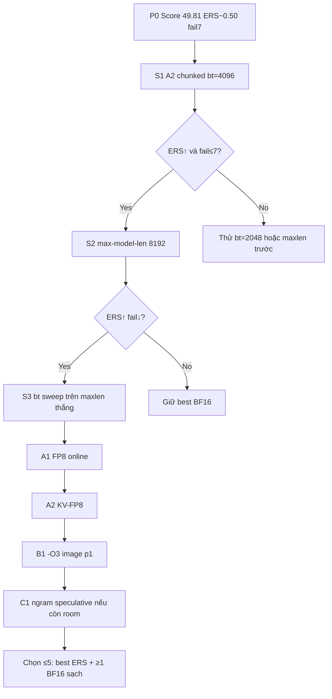

# PLAN.md — Optimization Playbook (Post-P0)
## Viettel AI Race 2026 · Challenge 3 · Team Develarper

> Chiến lược nền: [CONTEXT.md](CONTEXT.md) · Đề: [PROBLEM_VN.md](PROBLEM_VN.md) · Nộp: [SUBMIT.md](SUBMIT.md)  
> **Model:** `LiquidAI/LFM2.5-1.2B-Instruct` · **Slice:** MiG H200 **18GB** · **Engine:** **vLLM only**  
> **Image baseline:** `longquanton/develarper-lfm25:p0` (vLLM **0.23.0**, weights bake `/model`)  
> **Deadline Phase 1:** 30/07/2026 · Cập nhật: **2026-07-21 23:31** — X1 **FAIL probe** → rollback P0

---

## ★ HOTFIX — X1 bị BTC abort (22:59)

```text
protocol aborted: long-context probe failed (0%) - truncation / dual-path likely
```

| | Chi tiết |
|---|---|
| Nộp | X1 Decode-Max (O3 + interactivity + **ngram speculative**) |
| Kết quả | **Thất bại** — không có ERS (protocol abort trước/bench) |
| Nghiêm trọng | BTC gắn nhãn truncation / dual-path — **cấm nộp lại X1** |
| Nguyên nhân khả dĩ #1 | `--speculative-config` ngram làm long-context probe trả lời lệch/cắt |
| #2 | `-O3` / `interactivity` làm startup hoặc hành vi probe không ổn |
| **Fix ngay** | Root compose = **P0 thuần** (đã chấm 49.81, maxlen **32768**) |

**Không phải** lỗi filename / image pull kiểu cũ. Probe long-context của BTC **bắt buộc** hành vi serving “thẳng”; speculative dễ bị coi bất thường.

### Bạn nộp gì bây giờ

1. Upload root [`docker-compose.yml`](docker-compose.yml) = **P0** (đã rollback).  
2. ≥600s từ lần X1 fail · còn quota.  
3. **Không** thêm speculative / interactivity cho đến khi có plan riêng đã cô lập.  
4. Sau này nếu muốn thử lại: chỉ [`submit/docker-compose.x1b_o3_only.yml`](submit/docker-compose.x1b_o3_only.yml) (**chỉ** `-O3`, không ngram).

Archive X1 fail: `submit/docker-compose.x1_decode_max.yml`

---

## ★ X1 DECODE-MAX — HUỶ cho Portal (giữ lesson)

Gói O3+interactivity+ngram **không dùng lại** trên Portal sau lỗi probe. FP8 / -O3 đơn lẻ vẫn có thể thử **sau** khi P0 ổn định lại trên leaderboard mindset.

### Ngân sách eval (nhắc)

~5/ngày · ~6–10 shot ý nghĩa còn lại · **P0 luôn trong shortlist GPQA**.

---

## 0. Executive verdict

| | |
|---|---|
| Champion | **P0 = 49.81** |
| X1 | **FAIL protocol** — bỏ speculative khỏi chiến lược gần |
| Next submit | **P0 thuần** (hotfix) rồi mới X1b (`-O3` only) hoặc X2 FP8 |
| Cấm | ngram speculative trên Portal cho đến khi hiểu rõ probe BTC |

---

## 1. Khóa đề & biên hợp lệ (không đàm phán)

### 1.1 Công thức

```text
Score = 100 × ERS × f(Δ)
Online  = tối đa hóa ERS (+ reliability)
Post    = chọn ≤5 submission → GPQA; cần Δ an toàn (≤0.10 giữ hệ số tốt)
```

| Param | Value |
|---|---|
| F_ttft / C_ttft | 10 / 400 ms |
| F_tpot / C_tpot | **1 / 10 ms** |
| γ | 2 |
| w | 0.5 |
| Acc baseline (ref) | ~0.4 |

### 1.2 BTC cho phép (đòn bẩy “cao cấp” vẫn hợp lệ)

| Được | Không được |
|---|---|
| Custom public Docker image | TRT-LLM / SGLang / engine khác |
| Sửa **source vLLM** trong image (admin forum) | Đổi weights sang model khác / “lookalike” |
| Online FP8 / KV-FP8 / flags engine | Pull HF / mạng ngoài lúc container chạy |
| Prefix cache, chunked prefill, CUDA graphs, compile | Dual-path (bench vs GPQA khác nhau) |
| Speculative **trong vLLM** nếu vẫn serve đúng `/model` | Entrypoint lệch form mẫu BTC |
| Bake weights + (tuỳ chọn) torch.compile cache | Pre-bake câu trả lời / fake streaming |

**Entrypoint bắt buộc:** `python3 -m vllm.entrypoints.openai.api_server`  
**File nộp:** đúng tên `docker-compose.yml` · Image Hub **public** · ≥600s giữa 2 submit · ≤5 submit/ngày.

### 1.3 Workload thật (lab duy nhất đáng tin = Portal)

Meta BTC (`eval/traces/btc_workload_meta.json`):

| Field | Value |
|---|---|
| Conversations × turns | 70 × 6 = **420** requests |
| shared_system_prefix | 1000 tok |
| per_conversation_prefix | 1000 tok |
| new_user / turn | 150 |
| output pinned / turn | **300** |
| Arrival | Poisson seed 42 |

**Ước context peak / hội thoại (turn 6):**

```text
input ≈ 1000 + 1000 + 6×150 + 5×300 = 4400 tokens
(+ margin chat template / special tokens) → thiết kế max-model-len ≈ 5120–8192 là đủ
```

→ Giữ `32768` như P0 **lãng phí KV trên 18GB** → ít concurrency / dễ preemption → **TPOT xấu + fail**. Đây là insight #1 sau P0.

---

## 2. Chẩn đoán P0 bằng toán ERS (vì sao ~50 điểm)

Approximation với median quan sát (P0):

| Trục | Latency | `s = ((C−x)/(C−F))^γ` |
|---|---|---|
| TTFT | 48 ms | `((400−48)/(400−10))^2 ≈ **0.81**` |
| TPOT | 6 ms | `((10−6)/(10−1))^2 ≈ **0.20**` |
| ERS≈0.5·0.81 + 0.5·0.20 | | **≈ 0.50** (khớp Score 49.81) |

**Sensitivity (γ=2):**

| Nếu TPOT median | s_tpot | ERS ước (TTFT giữ 48ms) |
|---|---|---|
| 6.0 ms (P0) | 0.20 | ~0.50 |
| 4.0 ms | 0.44 | ~0.63 |
| 3.0 ms | 0.60 | ~0.71 |
| 2.0 ms | 0.79 | ~0.80 |
| 1.5 ms | 0.89 | ~0.85 |

→ **Mỗi 1ms TPOT gần floor = nhảy điểm lớn.** TTFT từ 48→20ms chỉ nâng s_ttft ~0.81→0.95 → ERS +~0.07 — kém hơn hạ TPOT 6→3ms.

**Fail penalty:** 7/420 ≈ 1.7% request S=0; ưu tiên về **0 fail** trước khi chase 0.01 ERS bằng quant rủi ro.

---

## 3. Bản đồ đòn bẩy A→Z (ranked)

Thứ tự = **Expected ΔERS × P(hợp lệ) / Risk(Δ,fail,OOM)**. Chỉ 1 biến chính / submit Portal.

### Tier S — làm sớm (compose-only, image `p0` giữ nguyên)

| ID | Kỹ thuật | Vì sao | Rủi ro | File / flag |
|---|---|---|---|---|
| **S1** | **Chunked + `max-num-batched-tokens`** | V1 ưu tiên decode; nhỏ hơn → ITL/TPOT tốt hơn dưới prefill chồng | TTFT có thể ↑ nhẹ (OK vì còn dư) | `submit/docker-compose.a2_chunked.yml` (4096) |
| **S2** | **Hạ `max-model-len` → 8192 rồi 6144/5120** | Workload peak ~4.4k; giải phóng KV → concurrency ↑, preemption ↓ | Quá thấp → reject/fail nếu BTC template phình | Compose mới `a3_maxlen*` |
| **S3** | Sweep batched-tokens **2048 / 4096 / 8192** | Docs vLLM: nhỏ = ITL tốt; lớn = TTFT/throughput | Quá nhỏ → TTFT xấu / under-util | Compose `a4_bt*` |
| **S4** | `gpu-memory-utilization` 0.90 chỉ khi OOM/fail | P0 đã 0.95; đừng hạ sớm | Mất KV | `a1_mem90` |

### Tier A — quant / dtype (vẫn vLLM, cùng `/model`)

| ID | Kỹ thuật | Vì sao trên H200 MiG | Rủi ro Accuracy Gate |
|---|---|---|---|
| **A1** | `--quantization fp8` (online) | Matmul nhanh hơn BF16 trên Hopper-class; model 1.2B nhẹ | Δ GPQA — **giữ P0 BF16** làm ứng viên f(Δ)=1 |
| **A2** | `--kv-cache-dtype fp8` | Gấp đôi “chỗ” KV → batch lớn hơn → TPOT | Đôi khi ITL xấu hơn (issue cộng đồng); A/B bắt buộc |
| **A3** | FP8 weights **+** KV-FP8 | Chỉ sau khi A1/A2 đơn lẻ thắng | Cộng dồn Δ |

### Tier B — compilation / runtime (image mới `p1`+)

| ID | Kỹ thuật | Nguồn | Ghi chú |
|---|---|---|---|
| **B1** | `--optimization-level 3` | Liquid LFM2.5 recipe: ~+2% steady-state | Startup lâu hơn — bake/warm OK trên BTC nếu health timeout đủ |
| **B2** | Bake **torch.compile cache** vào image + `VLLM_FORCE_AOT_LOAD=1` (nếu match GPU) | vLLM optimization docs | **Cẩn thận:** cache H200 ≠ máy build; ưu tiên compile **trên cùng arch** hoặc bỏ force |
| **B3** | Tắt log thừa (`--no-enable-log-requests` nếu flag tồn tại trên 0.23) | Giảm overhead CPU path | Đã học: `--disable-log-requests` **sai** trên 0.23 |
| **B4** | `VLLM_USE_FASTOKENS=1` (+ cài `fastokens`) | Recipe: hạ TTFT tokenization-bound | Ít đụng TPOT; optional |
| **B5** | Mamba/Lfm knobs: `--mamba-backend`, cache mode | Recipe “experiment if you like” | Ưu tiên thấp; 1 flag/lần |

### Tier C — kỹ thuật cao vẫn trong biên vLLM (sau khi S+A bão hòa)

| ID | Kỹ thuật | Hợp lệ? | Khi nào |
|---|---|---|---|
| **C1** | **N-gram / suffix speculative** (`--speculative-config`) | Có — không cần draft model ngoài, vẫn target `/model` | Khi TPOT còn >3ms sau S/A; đo acceptance + fail |
| **C2** | Draft-model speculative (LFM 350M/230M bake thêm) | **Xám** — vẫn verify target = Instruct 1.2B; tăng image + VRAM | Chỉ nếu C1 có tín hiệu và còn VRAM |
| **C3** | Patch source vLLM (scheduler bias decode, prefix block size, Lfm2 kernel path) | Admin cho phép sửa vLLM | Khi flag hết room; cần tag `p2-src` + changelog nội bộ |
| **C4** | PD-disagg / Mooncake / multi-GPU | **Không** — 1× MiG 18GB | Bỏ |

### Tier X — cố ý không làm

- Đổi sang TRT-LLM / SGLang / TensorRT
- Serve model khác hoặc quant “lạ” làm logits lệch nặng
- Network / HF token lúc runtime
- Dual behavior theo header / env “BENCH”
- Overwrite tag `p0` đã chấm (dùng `p1`, `p2`…)
- Speculative làm **đổi phân phối output** mà không smoke GPQA

---

## 4. Lịch ablation Portal (sau P0)

Constraint: **≤5 submit/ngày**, cách **≥600s**, 1 biến chính / lần, ghi [`eval/ablation_sheet.md`](eval/ablation_sheet.md).



### Hàng đợi nộp

| # | ID | Nội dung | Mục tiêu |
|---|---|---|---|
| ✓ | P0 | BF16 baseline | Champion **49.81** |
| ✓ | S1S2 | maxlen+bt | Fail ERS |
| ✓ | X1 | ngram+O3+interactivity | **FAIL probe — cấm** |
| **0** | **P0 hotfix** | compose thuần P0 | **Nộp ngay** |
| 1 | X1b | chỉ `-O3` | sau hotfix |
| 2 | X2 | FP8 | rủi ro Δ |

**Winner rule:** ERS↑ **và** failed_count không tăng → giữ; ngược lại rollback.  
**Accuracy:** luôn giữ **≥1** submission BF16 (P0 hoặc best BF16) trong shortlist GPQA.

---

## 5. Target số học (North Star)

| Mốc | TPOT median | Fail | ERS ước* | Score ước (f=1) |
|---|---|---|---|---|
| P0 (đã có) | 6 ms | 7 | ~0.50 | ~50 |
| M1 | ≤4 ms | ≤3 | ~0.62 | ~62 |
| M2 | ≤3 ms | 0 | ~0.70 | ~70 |
| Stretch | ≤2 ms | 0 | ~0.80 | ~80 |

\*Giả định TTFT p50 giữ ~40–60ms. Không phải cam kết — là **hướng tune**.

---

## 6. Image tags & DevOps hygiene

| Tag | Nội dung | Khi tạo |
|---|---|---|
| `p0` | BF16 bake, v0.23.0 — **đã chấm, không overwrite** | Done |
| `p1` | + `-O3` / fastokens / env compile (nếu cần) | Sau khi compose-only bão hòa |
| `p2` | + speculative config bake / patch vLLM nhỏ | Chỉ khi Tier C |
| `gpqa-safe` | Alias digest BF16 sạch | Trước chọn Accuracy Gate |

Checklist mỗi lần nộp:

- [ ] Filename đúng `docker-compose.yml`
- [ ] Image **public**, digest ghi ablation sheet
- [ ] Entrypoint form BTC
- [ ] `--model=/model`, `--served-model-name=LFM2.5-1.2B-Instruct`
- [ ] Không flag lạ đã fail CLI (vd. `--disable-log-requests`)
- [ ] Offline runtime (không HF)
- [ ] ≥600s từ submit trước

---

## 7. Roles (giữ)

| ID | Owns | Decide |
|---|---|---|
| **AI1** | Quant / Δ GPQA smoke | Có giữ FP8 vào shortlist không |
| **AI2** | Flag order, ers_sim, ablation sheet | Nộp ID nào tiếp |
| **DO** | Hub tag, compose Portal, anti-cheat | Freeze digest |

Daily 15’: Score mới / fail / còn mấy lượt / ID tiếp theo trong §4.

---

## 8. Definition of Done — Phase 1 (cập nhật)

- [x] Image Hub public + P0 ERS > 0
- [x] Prefix caching ON trên baseline
- [ ] ≥3 ablation có kiểm soát **sau P0** (S1, S2, …)
- [ ] failed_count → **0** trên best
- [ ] Best ERS ≥ **M1 (~0.62)** hoặc chứng minh ceiling phần cứng
- [ ] ≥1 BF16 digest trong ứng viên Accuracy Gate
- [ ] Anti-cheat checklist xanh trên winner

---

## 9. Next actions

1. Nộp **X1** — root `docker-compose.yml` (đã sẵn).  
2. Giữ P0 trong shortlist GPQA.  
3. Nhánh sau X1: xem § ★ X1 (X1b / X2 FP8).

Chi tiết: **[SUBMIT.md](SUBMIT.md)**.

---

## 10. Phụ lục — vì sao không ưu tiên một số “kỹ thuật hay”

| Ý tưởng | Lý do xếp thấp / loại |
|---|---|
| Tensor parallel | Model 1.2B fit 1 GPU; recipe Liquid: TP **không** giúp |
| `max-model-len=32768` mãi | Workload ~4.4k; phí KV trên 18GB |
| Chase TTFT <20ms | Marginal ERS vs effort; TPOT quan trọng hơn |
| Mooncake / disagg PD | Không đủ GPU / ngoài scope MiG đơn |
| Offline GPTQ nặng | Online FP8 đề khuyến khích; GPTQ thêm pipeline + rủi ro Δ |
| Sửa sampling server-side | BTC client kiểm soát generation; đừng lệch behavior |

---

*Plan này là nguồn sự thật cho tối ưu sau P0. Mọi thay đổi flag/image phải map về một ID trong §3–§4 và một dòng trong ablation sheet.*
