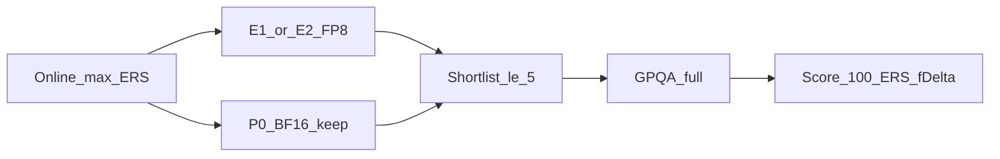

# ERS vs Accuracy (Δ) — bản E1+/E2 so với P0

## Trả lời thẳng

| Câu hỏi                           | Trả lời                                                                                                     |
| --------------------------------- | ----------------------------------------------------------------------------------------------------------- |
| Portal đang báo Δ giảm vì FP8?    | **Không.** Online `f_delta=1`, `accuracy_drop=0` trên P0 / S1S2 / E1+ — BTC **chưa** chạy GPQA mỗi lần nộp. |
| FP8 có rủi ro làm Δ thật xấu hơn? | **Có thể** (sau vòng, khi GPQA). Weight FP8 đổi numerics; KV-FP8 thường nhẹ hơn.                            |
| Đang “đánh đổi ERS lấy Δ”?        | **Online:** không — chỉ tối ưu ERS. **Score cuối:** có rủi ro nếu chỉ chọn bài FP8 và Δ ≥ 0.10.             |
| Vẫn đảm bảo accuracy ổn?          | **Có**, nếu shortlist luôn gồm **P0 BF16** + best ERS (E1+/E2).                                             |

```text
Online leaderboard ≈ 100 × ERS          (f_delta hiển thị = 1)
Score cuối        = 100 × ERS × f(Δ)   (Δ từ GPQA trên ≤5 bài chọn)
```

`f(Δ)=1` nếu Δ ≤ 0.10; giảm dần tới 0 nếu Δ ≥ 0.16 (baseline GPQA ref ~0.4).

## So sánh bản theo accuracy kỳ vọng (ước lượng — chưa đo GPQA)

| Bản                | ERS (đã đo) | Δ kỳ vọng vs baseline BF16    | Vai trò                       |
| ------------------ | ----------- | ----------------------------- | ----------------------------- |
| **P0** BF16        | 49.81       | Thấp nhất (neo Accuracy Gate) | Bắt buộc trong ≤5 bài         |
| S1S2               | 48.45       | ≈ P0 (vẫn BF16)               | Bỏ                            |
| **E1+** FP8+KV     | **59.57**   | Có thể cao hơn P0             | Champion ERS online           |
| **E2** (+O3+mamba) | chưa        | ≈ E1+ (không đổi quant)       | Đẩy ERS thêm, Δ không đổi lớp |

E2 không “giảm accuracy thêm” so E1+ về quant; nó chỉ thêm compile/kernel. Rủi ro Δ nằm ở **lớp FP8**, không ở `-O3`/flashinfer.

## Chiến lược chốt (không phá luật)



1. **Tiếp tục đẩy ERS** với E2 (và sau đó freeze) — đúng mục tiêu online.
2. **Không overwrite / không bỏ P0** — P0 = bảo hiểm f(Δ)=1.
3. Sau online: chọn **P0 + best FP8**; nếu GPQA cho FP8 có Δ ≤ 0.10 thì Score cuối lấy FP8×1; nếu Δ xấu thì đội vẫn còn P0 (ERS thấp hơn nhưng f=1).
4. (Khuyến nghị thêm) Smoke GPQA 1 lần trên endpoint FP8 trước khi chốt shortlist — không bắt buộc để nộp E2.

## Việc làm tiếp (khi bạn bật Agent)

- Nộp E2 từ [`docker-compose.yml`](docker-compose.yml) (đã = E1+ + O3 + mamba FI).
- Ghi ablation: giữ hàng P0 + E1+ + E2; cột “GPQA role” = P0 anchor / E\* ERS.
- Không cần đổi flags E2 chỉ vì lo Δ online — Portal không trừ Δ lúc này.

## Không làm

- Bỏ FP8 chỉ vì sợ Δ khi chưa GPQA (mất +10 ERS đã prove).
- Chỉ shortlist mỗi bài FP8.
- Mở lại speculative để “bù accuracy” (X1 đã fail probe).
